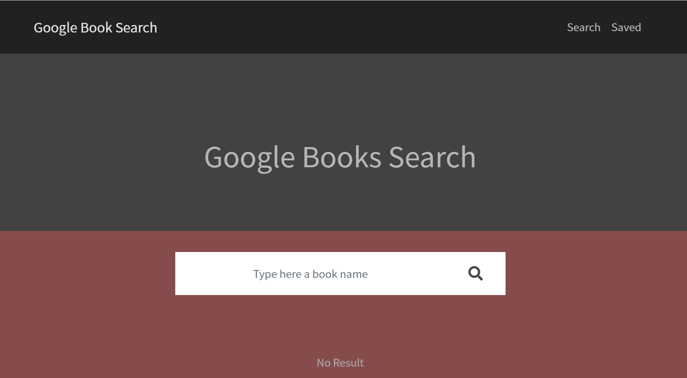

# GOOGLE Books Search

[]

## Description

​
This is a book search with google book Api, created with React.

The serach app can find any book from google by typing a name in search field.

## Table of Contents

- [Installation](#installation)

- [Usage](#usage)

- [License](#license)

- [Contributing](#contributing)

- [Tests](#tests)

- [Questions](#questions)

## Installation

​
To install necessary dependencies, run the following command:
​
npm install
​

## Usage

​
Run "npm start" to start the server localhost:3000
​

## Demo

​
To see my work:

## License

​
This project is licensed under the MIT license.

## Contributing

​
[FullStackable]('https://github.com/cynmojica1231/Homework21')

## Tests

​
To run tests, run the following command:
​
npm test
